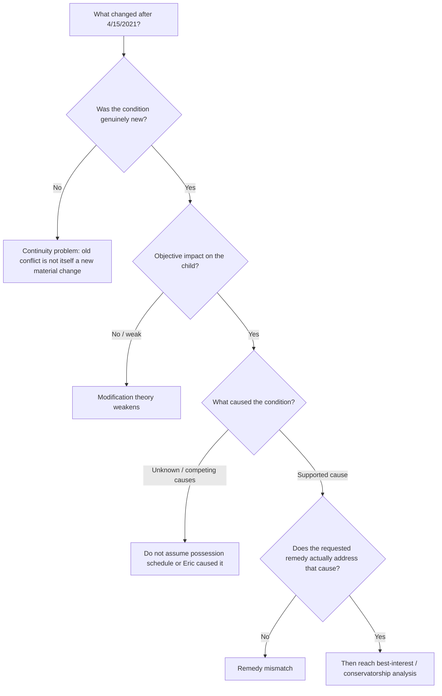

# Wright v. Wright — Attorney Briefing Room

> ## The question that should organize the whole case
> **What materially changed after 4/15/2021 — and why would that new condition be solved by reducing Eric's rights, possession, or authority?**

Everything in this repository is being organized to answer that question quickly, with one-click access to the proof.

**If you have five minutes, read only this page.** If something catches your attention, click it.

---

# If you remember only three things

## 1. The requested custody outcome appears to predate the alleged reasons for it

Before the operative 4/15/2021 order, Sana was already saying she should have primary custody, that she **deserved** it, and that Eric did not deserve 50/50.

After the order, many of the same allegation categories continue: safety, school, medical care, judgment, co-parenting, possession conflict, marijuana/gambling, disparagement, and whether equal possession is appropriate.

That creates a potentially powerful chronology problem:

> **Did a new material condition create the desire for modification — or did the desired custody outcome exist first, with later allegations supplying the argument?**

We do **not** need to prove Sana's psychology to make that chronology matter.

[→ See the pre/post-cutoff material-change synthesis](analysis/material-change-synthesis.md)  
[→ See the “deserve more custody” chronology](index/deserve-language.md)

---

## 2. There is one genuinely important newer fact: Rayan's behavior deteriorated

The 2025–26 school record is not nothing. It shows a real increase in tardies, discipline, fights, ISS/OSS, and disruptive behavior.

That is probably the strongest candidate for a genuine post-cutoff changed condition.

But the present record does **not** answer the next two questions:

> **What caused it?**  
> **Why would less time or fewer rights for Eric solve it?**

The competing record includes neutral-counselor evidence that Rayan felt caught between parents, old child-authored writings about being a `bad seed` / feeling unloved, later child messages describing fear/rejection, and other evidence of emotional pressure that does not map neatly onto a `50/50 caused this` theory.

So the school problem should not be minimized — it should be **causally analyzed**.

[→ Rayan behavior / causation analysis](analysis/rayan-behavior-causation-hypotheses.md)  
[→ School records](reviews/2025-2026-rayan-school-records.md)  
[→ Heidi Zimmerman](reviews/heidi-zimmerman-evidence.md)  
[→ Rayan texts](reviews/rayan-text-message-evidence.md)

---

## 3. Eric's desired end state is not “win the kids”

Eric's position is unusual enough that it matters:

> **He does not want to reduce the children's relationship with Sana. He wants the children to have substantially the same access to both parents — but without ordinary childhood decisions constantly becoming custody transactions.**

His complaint is not that the current schedule gives Sana too much time. His complaint is that he can offer the children flexibility only during his own possession periods, which means the children do not actually have flexibility.

Aleena has described feeling like **“a ball”** being passed between households. The children appear to want something simpler: access to both parents, less pressure, less ownership language, and more ability to live ordinary lives.

If the court ever concludes that additional legal authority is warranted, Eric's stated purpose would be to use that authority to **de-escalate possession as leverage**, not to exclude their mother.

That leads to the remedy question counsel should help define:

> **What Texas conservatorship structure, if any, can create child-centered flexibility without unnecessarily diminishing either parent-child relationship?**

[→ Case theory / remedy framing](notes/case-theory.md)

---

# The case as a decision tree

That is the logic this repository is trying to enforce on every allegation.

---

# The more provocative theory — useful only if the proof carries it

Eric's deeper theory is that the litigation narrative may reflect **conflict-state accusations and a longstanding felt entitlement to greater custody**, rather than a stable belief that he is actually unsafe, irresponsible, or incapable.

There is now some historical support for examining that possibility carefully:

- Sana's own 2014 email says she `said something to hurt you` during conflict;
- she distinguished fight-language from what she believed about Eric `at his core`;
- she acknowledged acting `out of spite`;
- she acknowledged using young Rayan in an adult conflict to affect Eric's behavior;
- later she described herself as `desperate for validation for someone to accept me`;
- contemporaneous records confirm marriage counseling with **Dr. David Whiteaker**;
- in 2022, Eric was already writing in TalkingParents that the marriage counseling had addressed a `fear of abandonment` and behavior that could `promote abandonment` — years before this case presentation was assembled.

That is **not a diagnosis**, and it is not necessary to win the threshold material-change argument. It is potentially relevant as chronology, credibility, motive/pretext context, and explanation for why accusations can be intense while the underlying parenting arrangement continues to function.

[→ Historical relationship / Whiteaker evidence](reviews/historical-relationship-email-evidence.md)  
[→ Click directly into the Gmail / Drive proof](index/evidence-links.md)

---

# A pattern worth counsel's attention: custody as leverage

One recurring fact pattern is more concrete than psychology:

**cooperation, compromise, peace, or child activities become linked to Eric agreeing that Sana should receive more custody.**

Examples include repeated `deserve more time` language, litigation tied to ending 50/50, and extracurricular participation / cooperation being conditioned on her receiving more time.

That may matter because it allows the motive/pretext issue to be argued from **conduct**, not mind-reading.

[→ “Deserve” chronology](index/deserve-language.md)  
[→ Gymnastics / taekwondo pattern](reviews/extracurricular-gymnastics-taekwondo-pattern.md)

---

# Proof ledger — current state of the case

| Proposition | Current proof state | Best evidence | Main weakness / question |
|---|---|---|---|
| Major allegations existed before 4/15/21 | **Strong** | TalkingParents chronology | Legal significance depends on exact modification standard |
| Sana wanted greater / primary custody before current alleged changes | **Strong** | Repeated `deserve` statements beginning 2019–21 | Desire alone does not invalidate later genuine concerns |
| 50/50 became newly unsafe after 4/15/21 | **Not presently established** | Opposing allegations exist | Need objective new condition + causation + remedy nexus |
| Rayan experienced genuine behavioral deterioration | **Strong** | 2025–26 school records | Cause remains unresolved |
| Eric / equal possession caused Rayan's deterioration | **Not presently established** | No neutral causal finding found | Competing emotional / peer / developmental explanations |
| Child emotional pressure around parental conflict exists | **Strong / multi-source** | Heidi, child writings, texts | Some sources are child reports and need authentication/context |
| Sana's conflict-state statements may differ from stable assessments | **Partially corroborated** | 2014 emails + positive parenting assessments | Do not overgeneralize one historical pattern to every allegation |
| Activities / cooperation have been used as custody leverage | **Strong examples** | TalkingParents gymnastics / compromise statements | Need counsel to define legal relevance |
| Eric wants to erase Mom from the children's lives | **Contradicted by his stated position and multiple conduct examples** | offers of contact/flexibility, co-parent lunches, current remedy position | Opponent may argue rhetoric / implementation inconsistencies |

---

# What would change our view?

This repository is designed to be falsifiable.

The case model should change if we find reliable evidence of any of the following:

- a genuinely new post-4/15/2021 condition caused by Eric that materially harmed the children;
- neutral professional evidence tying equal possession or Eric's household to Rayan's deterioration;
- proof that reducing Eric's rights/possession would actually remedy the identified harm;
- strong evidence that the current schedule itself — rather than parental conflict around it — is the problem;
- evidence undermining the credibility/authenticity/context of the child, counselor, school, or historical-email materials we are relying on.

[→ Eric adverse-facts file](analysis/adverse-facts.md)

That discipline is intentional. The objective is not to make Eric look perfect. It is to make the **decision path honest**.

---

# For Bruman / Erika: attack the model

The fact work is now developed enough that the highest-value contribution from counsel is **not another narrative summary**. It is to tell this evidence engine what legal rules actually control.

### Please start here:
## **[Legal decision rules — attorney input requested](law/decision-rules.md)**

The questions we most need answered are:

1. **What exactly counts as a material and substantial change in this posture?**
2. **How should pre-existing allegations be treated when they continue after the order?**
3. **What nexus must exist between a changed condition and the specific modification requested?**
4. **What rights / tie-breakers could legally create flexibility without unnecessarily changing actual parenting time?**
5. **Which evidence here is likely admissible, impeaching, remote, privileged, hearsay, or strategically distracting?**
6. **What proposition are we missing that you would need to prove or defeat at hearing/trial?**

If you disagree with the case theory, **great** — add the rule or fact that breaks it. The repository is more useful if it can be attacked than if it merely agrees with Eric.

---

# Drill anywhere

### Core analysis
- [Material-change synthesis](analysis/material-change-synthesis.md)
- [Claim-by-claim material-change matrix](analysis/claim-by-claim-material-change-matrix.md)
- [Rayan behavior causation hypotheses](analysis/rayan-behavior-causation-hypotheses.md)
- [Adverse facts / strongest opposing readings](analysis/adverse-facts.md)

### High-value evidence reviews
- [Heidi Zimmerman](reviews/heidi-zimmerman-evidence.md)
- [Historical relationship / Whiteaker evidence](reviews/historical-relationship-email-evidence.md)
- [Rayan school records](reviews/2025-2026-rayan-school-records.md)
- [Young Rayan journals](reviews/young-rayan-journal-entries.md)
- [Rayan text messages](reviews/rayan-text-message-evidence.md)
- [Gymnastics / taekwondo / extracurricular leverage](reviews/extracurricular-gymnastics-taekwondo-pattern.md)

### Proof / source navigation
- **[Clickable evidence links — Gmail + Google Drive](index/evidence-links.md)**
- [Source inventory](index/source-index.md)
- [Evidence map](index/evidence-map.md)
- [Event index](index/events.csv)
- [Allegation matrix](index/allegations.md)
- [Theme index](index/themes.md)

---

# Repository rule

Every important proposition should eventually be reducible to:

> **ASSERTION → PROOF → CONTEXT / COUNTER-READING → LEGAL RULE → DECISION**

That is the end state: not a giant divorce archive, but a case that can be understood in five minutes and audited to the source in one click.
