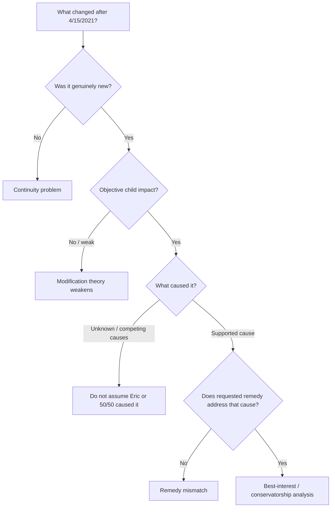
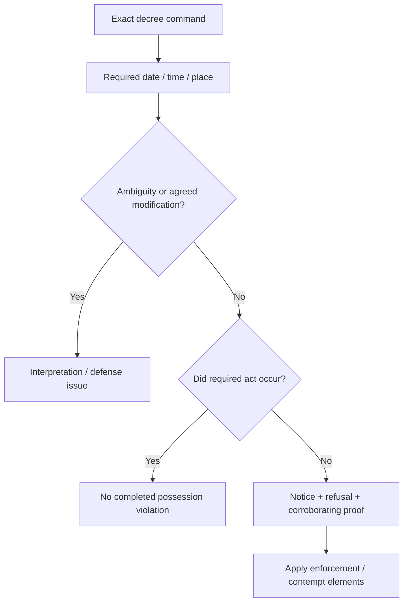

# Wright v. Wright — Attorney Briefing Room

> **Purpose:** a working, auditable case file for counsel — not a document dump.
>
> **Current stage:** discovery / evidence synthesis → **Sana deposition preparation** → witness / exhibit / trial architecture.
>
> **How to use this repository:** read this page in ~5 minutes, then click only where something matters to you.

---

# 60-second orientation for Bruman / Erika

There are **two live lanes**.

## Modification

> **What materially changed after 4/15/2021 — and why would that new condition be solved by reducing Eric's rights, possession, or authority?**

The current evidence model suggests that many of Sana's major allegations and her desired custody outcome **predate the operative order**. The strongest genuinely newer fact is Rayan's 2025–26 behavioral deterioration. That deterioration is real; its **cause** and the **remedy nexus** are not yet established.

## Enforcement

> **Is the 2026 summer withholding an isolated calendar dispute — or the latest event in a documented multi-year pattern of decree disputes, announced refusals, and actual failures to surrender possession?**

The record currently identifies four significant possession events — 2021, 2022, 2025, and 2026 — surrounded by repeated interpretation disputes, threatened deviations, and inconsistent treatment of decree deadlines. Counsel should decide which are legally actionable and which are useful only as context / pattern / notice.

## Immediate next procedural opportunity: Sana's deposition

The deposition should turn broad allegations into testable propositions:

`WHAT HAPPENED? → WHEN DID IT BEGIN? → WHAT PROVES IT? → WHAT HARM RESULTED? → WHAT CAUSED IT? → WHY DOES HER REQUESTED REMEDY FIX IT?`

[→ Sana deposition control matrix](depositions/sana-deposition-control-matrix.md)  
[→ Full deposition plan](depositions/sana-deposition-plan.md)

---

# What I need from counsel right now

Two inputs will materially improve the model immediately:

1. **Sana's discovery responses / production** — especially her interrogatory answers identifying what she claims materially changed, the factual basis for modification, witnesses, documents, experts, and requested relief.
2. **Legal calibration** — the actual Texas standards Bruman wants applied for material change, best interest, remedy nexus, enforcement / contempt, conservatorship rights, admissibility, and child preference / behavior.

[→ Legal decision rules — attorney input requested](law/decision-rules.md)

If a legal rule, fact, or piece of evidence breaks the current theory, **please break it**. The repository is designed to be corrected.

---

# The case in four propositions

## 1. The requested custody outcome appears to predate the alleged reasons for it

Before 4/15/2021, Sana was already asserting that she should have primary custody, that she **deserved** it, and that Eric did not deserve 50/50.

Many later allegation categories also existed before the order: safety / supervision, school, medical care, judgment, co-parenting, marijuana / gambling, possession conflict, disparagement, and whether equal possession was appropriate.

That creates the threshold chronology question:

> **Did a new material condition create the desire for modification — or did the desired custody outcome already exist, with later events becoming the argument for it?**

This does not require proving anyone's psychology.

[→ Material-change synthesis](analysis/material-change-synthesis.md)  
[→ Claim-by-claim material-change matrix](analysis/claim-by-claim-material-change-matrix.md)  
[→ “Deserve more custody” chronology](index/deserve-language.md)

---

## 2. Rayan's deterioration is real; causation is the unresolved question

The 2025–26 school record documents a genuine increase in tardies, discipline, fights, ISS / OSS, and disruptive behavior.

That may be the strongest genuine post-order changed condition in the case.

But the current record does **not** establish either of the two propositions necessary to jump from that fact to Sana's requested custody result:

> **Eric / equal possession caused the deterioration.**  
> **Reducing Eric's possession or authority would remedy it.**

The competing record includes neutral counselor evidence that Rayan felt caught between parents, child-authored writings describing negative labeling / feeling unloved, later child messages describing fear and rejection, peer conflict, adolescent behavior, and other plausible contributing factors.

The right response is not to minimize Rayan's problems. It is to analyze them causally.

[→ Rayan behavior / causation analysis](analysis/rayan-behavior-causation-hypotheses.md)  
[→ School records](reviews/2025-2026-rayan-school-records.md)  
[→ Heidi Zimmerman](reviews/heidi-zimmerman-evidence.md)  
[→ Rayan texts](reviews/rayan-text-message-evidence.md)

---

## 3. The enforcement case appears longitudinal, not isolated

The strongest possession-event anchors presently identified are:

| Date | Event | Current factual classification |
|---|---|---|
| **6/24/2021** | children unavailable at ordered pickup; Eric documented Sana saying she would not surrender until later | strong actual-failure candidate; verify decree / prior enforcement |
| **3/20/2022** | Spring Break return dispute followed by delayed / chaotic Walmart exchange | actual exchange event; legal classification needs decree + timing proof |
| **8/3–8/9/2025** | Sana announced she would not appear, retained children while in Colorado during Eric's designated week; replacement week later accepted | strong actual-withholding candidate |
| **8/2/2026** | no agreed schedule change; Eric appeared; children not surrendered; Sana told him to file / later said he did not deserve the time | current enforcement event |

The surrounding record matters too: holiday-rollover disputes, police / court threats, announced refusals, competing summer designations, and repeated disagreement over whether one parent can unilaterally redefine possession.

A potentially useful comparator: in **2023**, Eric designated his July week **two days late** and Sana insisted on strict April 1 compliance. In **2026**, Sana attempted to change her own summer designation after the applicable timing had passed and wrote:

> `you will take what I give you or you can file with Bruman`

That does **not** mean every disagreement is contempt. The chronology deliberately distinguishes actual noncompliance, threatened noncompliance, genuine ambiguity, and unsupported accusations.

[→ Decree compliance / enforcement chronology](enforcement/decree-compliance-chronology.md)

---

## 4. Eric's requested end state is not “win the kids”

Eric does not seek to eliminate or materially diminish the children's relationship with Sana.

His stated objective is closer to this:

> **Preserve meaningful access to both parents while reducing the ability of adult conflict, possession accounting, or unilateral vetoes to control ordinary childhood decisions.**

Aleena has described feeling like **“a ball”** being passed between households. Eric's position is that greater legal authority, if warranted at all, should be used to create practical flexibility — not to exclude their mother.

That leaves an important legal-design question for counsel:

> **What conservatorship structure, rights, or tie-breakers could solve the demonstrated problem without unnecessarily reducing either parent-child relationship?**

[→ Case theory / remedy framing](notes/case-theory.md)

---

# Two decision models

## Modification

## Enforcement

The repository should force every important contention through one of these structures rather than treating accusation as proof.

---

# Deposition strategy: convert narrative into admissions

The goal is not a theatrical cross-examination script. It is to remove ambiguity before trial.

For every material Sana allegation, lock down:

1. **Exact factual allegation** — what precisely does she contend Eric did or failed to do?
2. **Date of onset** — when did it first happen?
3. **Pre-4/15/2021 history** — did the same concern already exist before the operative order?
4. **Personal knowledge** — what did she actually observe versus hear from someone else?
5. **Proof** — document, witness, school record, medical record, recording, expert opinion?
6. **Child impact** — what objectively happened to Rayan or Aleena because of it?
7. **Causation** — what establishes that Eric / his household / equal possession caused that impact?
8. **Remedy** — what evidence shows the custody change she seeks would solve it?
9. **Alternative explanations** — what competing facts has she considered?
10. **Prior inconsistent statements / conduct** — TalkingParents, prior pleadings, counseling history, emails, activities, possession behavior.

[→ Sana deposition control matrix](depositions/sana-deposition-control-matrix.md)  
[→ Sana deposition plan](depositions/sana-deposition-plan.md)

Post-deposition, the target artifact becomes:

`ISSUE → PRIOR POSITION → DEPOSITION ANSWER → PAGE/LINE → PROOF → CONTRADICTION / CORROBORATION → TRIAL USE`

---

# Evidence model

Every significant proposition should ultimately become:

> **ASSERTION → PROOF → CONTEXT / COUNTER-READING → LEGAL RULE → DECISION → TRIAL USE**

That means the repository is intentionally not advocacy-only.

Facts are kept even when they are adverse to Eric. Ambiguous evidence gets both a litigation-risk reading and a defense / context reading. Historical accusations are separated from objective proof. Child statements are not automatically treated as independently proven adult conduct.

[→ Adverse facts / strongest opposing readings](analysis/adverse-facts.md)  
[→ Clickable evidence registry — Gmail + Google Drive](index/evidence-links.md)

---

# A secondary credibility / pretext hypothesis — use only if counsel thinks it helps

There is historical evidence worth preserving, but it should not become the center of the case unless the law and admissibility support it.

Sana's own historical communications include examples where she:

- said she had said something specifically **to hurt Eric** during conflict;
- distinguished fight-language from what she believed about him **“at his core”**;
- acknowledged acting **out of spite**;
- acknowledged using young Rayan in an adult conflict to affect Eric's behavior;
- later described herself as **“desperate for validation for someone to accept me.”**

The couple also attended marriage counseling with **Dr. David Whiteaker**. Eric's 2022 TalkingParents messages already memorialized his understanding that counseling had discussed a **fear of abandonment** and behavior that could **promote abandonment**.

This is **not a diagnosis** and does not prove later accusations false. Its narrower possible use is credibility / chronology / context if Sana presents her negative assessment of Eric as stable, longstanding, and unaffected by conflict state.

[→ Historical relationship / Whiteaker evidence](reviews/historical-relationship-email-evidence.md)

---

# Proof ledger — where the model stands today

| Proposition | Current proof state | Main unresolved question |
|---|---|---|
| Major allegation categories existed before 4/15/21 | **Strong** | exact legal effect under modification law |
| Sana wanted greater / primary custody before current alleged changes | **Strong** | desire alone does not defeat later genuine concerns |
| 50/50 became newly unsafe after 4/15/21 | **Not presently established** | what objective new evidence proves this? |
| Rayan experienced genuine behavioral deterioration | **Strong** | what caused it? |
| Eric / equal possession caused Rayan's deterioration | **Not presently established** | neutral causal evidence? |
| Child emotional pressure around parental conflict exists | **Strong / multi-source** | authentication / context for some child-sourced material |
| Activities / cooperation have been linked to custody demands | **Strong examples** | legal significance |
| Multi-year decree-compliance pattern exists | **Strong factual chronology; legal classification pending** | which events are actionable vs contextual? |
| 2026 summer event was wholly unforeseeable / accidental | **Record cuts against this** | Sana's legal interpretation defense |
| Historical conflict-state / stable-assessment contrast exists | **Partially corroborated** | admissibility, remoteness, proper use |

---

# What would change the current case model?

The model should change if reliable evidence shows any of the following:

- a genuinely new post-4/15/2021 condition caused by Eric that materially harmed the children;
- neutral professional evidence tying equal possession or Eric's household to Rayan's deterioration;
- evidence that reducing Eric's rights / possession would actually remedy the identified harm;
- evidence that the schedule itself — rather than conflict surrounding it — is harming the children;
- evidence undermining authenticity or context of child, counselor, school, email, or TalkingParents material;
- decree language, agreements, waiver, impossibility, or other authority showing a currently flagged enforcement event was authorized or excused.

The point is not to make Eric look perfect. It is to make the case model **falsifiable and courtroom-useful**.

---

# Build path from here to trial

`CASE THEORY → CLAIMS / DEFENSES → PROOF → DISCOVERY → DEPOSITIONS → ADMISSIONS → WITNESSES → EXHIBITS → OPENING → EXAMINATIONS → CLOSING`

### Current working artifacts

- **[Case-to-trial map](strategy/case-to-trial-map.md)** — overall litigation architecture.
- **[Sana deposition control matrix](depositions/sana-deposition-control-matrix.md)** — proposition / proof / objective / answer consequences.
- **[Sana deposition plan](depositions/sana-deposition-plan.md)** — detailed questioning strategy.
- **[Decree compliance chronology](enforcement/decree-compliance-chronology.md)** — violation / threat / ambiguity / allegation timeline.
- **[Legal decision rules](law/decision-rules.md)** — where counsel can correct the engine.

---

# Drill anywhere

### Core case analysis
- [Material-change synthesis](analysis/material-change-synthesis.md)
- [Claim-by-claim material-change matrix](analysis/claim-by-claim-material-change-matrix.md)
- [Rayan behavior causation hypotheses](analysis/rayan-behavior-causation-hypotheses.md)
- [Adverse facts / strongest opposing readings](analysis/adverse-facts.md)
- [Case theory / remedy framing](notes/case-theory.md)

### Enforcement
- **[Decree compliance / enforcement chronology](enforcement/decree-compliance-chronology.md)**

### Deposition / trial preparation
- [Case-to-trial map](strategy/case-to-trial-map.md)
- [Sana deposition plan](depositions/sana-deposition-plan.md)
- [Sana deposition control matrix](depositions/sana-deposition-control-matrix.md)

### High-value evidence reviews
- [Heidi Zimmerman](reviews/heidi-zimmerman-evidence.md)
- [Historical relationship / Whiteaker evidence](reviews/historical-relationship-email-evidence.md)
- [Rayan school records](reviews/2025-2026-rayan-school-records.md)
- [Young Rayan journals](reviews/young-rayan-journal-entries.md)
- [Rayan text messages](reviews/rayan-text-message-evidence.md)
- [Gymnastics / taekwondo / extracurricular leverage](reviews/extracurricular-gymnastics-taekwondo-pattern.md)

### Proof / source navigation
- **[Clickable evidence links — Gmail + Google Drive](index/evidence-links.md)**
- [Source inventory](index/source-index.md)
- [Evidence map](index/evidence-map.md)
- [Event index](index/events.csv)
- [Allegation matrix](index/allegations.md)
- [Theme index](index/themes.md)

---

# Counsel's role in this workflow

Treat this as an agile case-development loop:

**Eric / AI evidence engine → finished factual artifact → Bruman / Erika legal review → correction / prioritization → next artifact.**

The highest-value feedback is specific:

- **wrong legal rule**;
- **inadmissible / privileged / too remote**;
- **missing fact or element**;
- **wrong inference**;
- **stronger opposing interpretation**;
- **better deposition question**;
- **better remedy theory**;
- **better trial theme**.

If something here is wrong, mark it. If something is useful, drill into it. If something is missing, tell the engine what you need and it can be built.